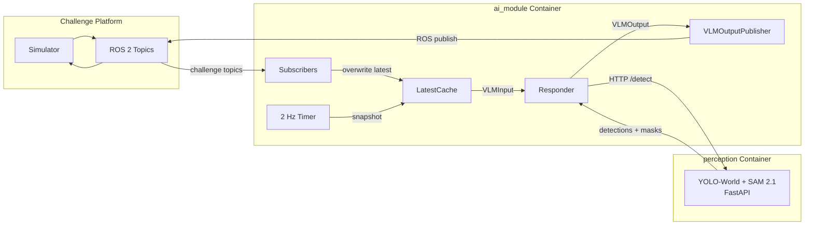
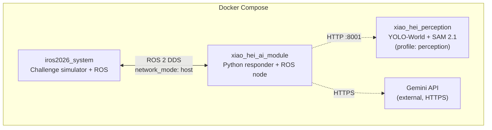
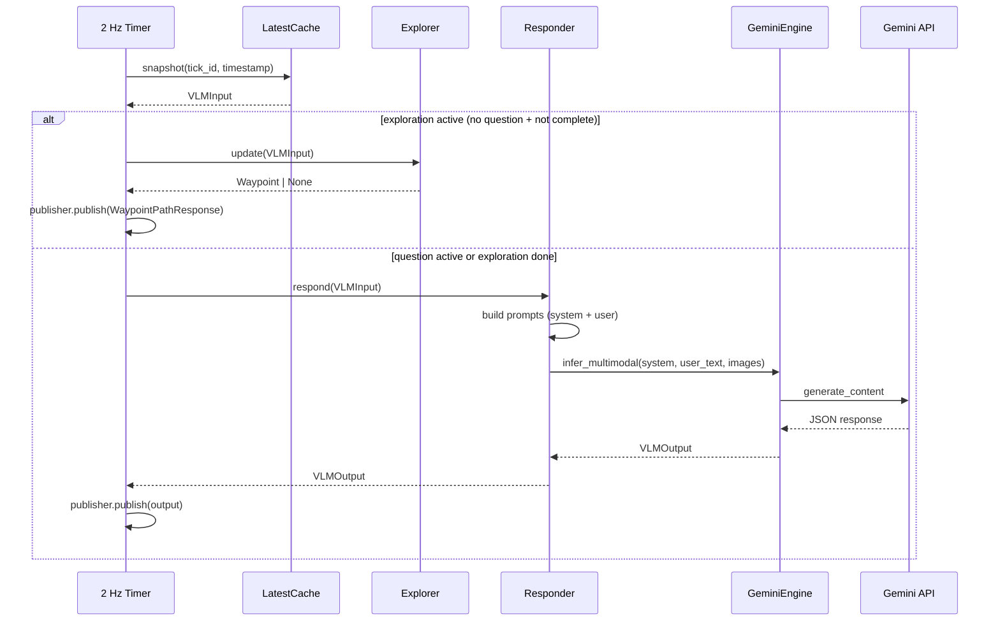

# System Architecture

## High-level data flow



## Container topology



`system` and `ai_module` always start. The `perception` sidecar is
profile-gated — the wrapper maps `XIAO_HEI_RESPONDER=perception` to
`--profile perception`, so it only runs when a responder needs it. The
submission stack (`scene_gemini`) brings up the sim, the sidecar and our
node together via `docker/compose_scene_gemini.yml`, and reaches Gemini
over the network rather than running a local inference server. See
[Docker setup](getting-started/docker.md) and
[Perception Sidecar](perception-sidecar.md).

All containers share `network_mode: host` so ROS 2 DDS discovery and
the sidecar HTTP APIs work without port mapping.

## Input topics

| ROS topic | Rate | Python type | Description |
|---|---|---|---|
| `/camera/image` | ~10 Hz | `ImageFrame` | 1920x640 BGR8 panoramic |
| `/registered_scan` | ~5 Hz | `LidarScan` | (x,y,z,intensity) in map frame |
| `/sensor_scan` | ~5 Hz | `LidarScan` | (x,y,z) in sensor frame |
| `/terrain_map` | ~5 Hz | `TerrainMap` | Local 5m traversability |
| `/terrain_map_ext` | ~5 Hz | `TerrainMap` | Extended 20m traversability |
| `/state_estimation` | 100–200 Hz | `OdomPose` | Robot pose in map frame |
| `/challenge_question` | 1 Hz | `ChallengeQuestion` | Natural language question |
| `/way_point_reached` | continuous | `Float32` | Nav stack distance to current waypoint (exploration only) |

## Output topics

| Question type | Python class | ROS topic |
|---|---|---|
| Numerical | `NumericalResponse` | `/numerical_response` |
| Object reference | `ObjectReferenceResponse` | `/selected_object_marker` |
| Instruction following | `WaypointPathResponse` | `/way_point_with_heading` |

## Module map

```
src/xiao_hei_vln/
├── messages/      # Pydantic models for all I/O types
├── sync/          # LatestCache — thread-safe sensor buffer
├── adapters/      # ROS 2 subscribers + publishers
├── app/           # rclpy entry point, tick loop, explorer + responder factory
├── exploration/   # Exploration strategies (FrontierExplorer + protocol)
├── logger.py      # VLM tick logger (model-agnostic)
├── image_utils.py # Shared image conversion helpers
├── dummy/         # Reference responder (no GPU)
├── gemini/        # Gemini engine, prompts, offline batch evaluator, tracer
├── scene_gemini/  # Submission responder: exploration + scene graph + Gemini
├── scene/         # Three-level scene graph (Room/Viewpoint/Object) + renderer
├── trajectory/    # Offline coverage-trajectory planner (Task 7)
├── perception/    # PerceptionResponder + HTTP client + lifter + vocabulary
├── evaluator/     # Offline metrics (numerical, object reference)
├── eval_sampler/  # Ground-truth ↔ prediction pairing
└── eval_pipeline/ # End-to-end evaluation CLI
```

## Tick lifecycle

The tick loop runs in two phases.  Exploration runs first; the responder
only runs once exploration is complete or a question is active.


