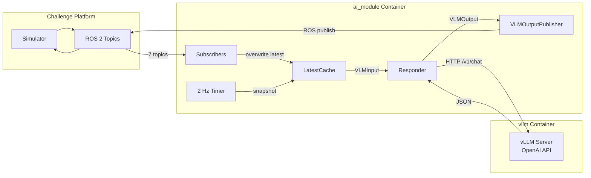
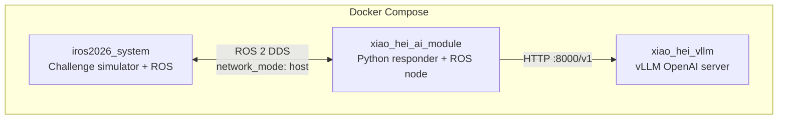
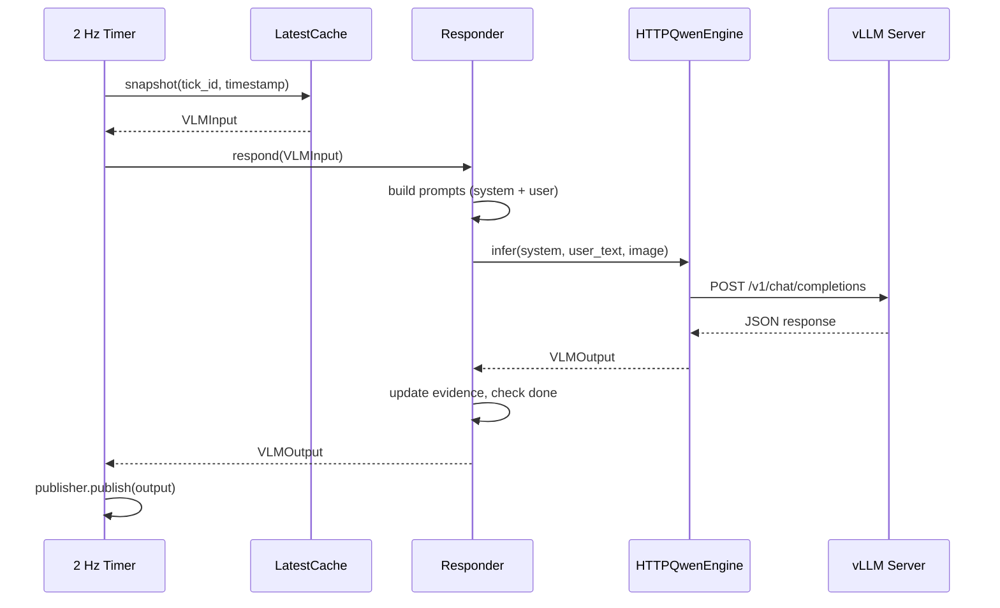

# System Architecture

## High-level data flow



## Container topology (GPU compose)



All three containers share `network_mode: host` so ROS 2 DDS discovery and the vLLM HTTP API work without port mapping.

## Input topics

| ROS topic | Rate | Python type | Description |
|---|---|---|---|
| `/camera/image` | ~10 Hz | `ImageFrame` | 1920x640 BGR8 panoramic |
| `/registered_scan` | ~10 Hz | `LidarScan` | (x,y,z,intensity) in map frame |
| `/sensor_scan` | ~10 Hz | `LidarScan` | (x,y,z) in sensor frame |
| `/terrain_map` | ~10 Hz | `TerrainMap` | Local 5m traversability |
| `/terrain_map_ext` | ~10 Hz | `TerrainMap` | Extended 20m traversability |
| `/state_estimation` | ~200 Hz | `OdomPose` | Robot pose in map frame |
| `/challenge_question` | 1 Hz | `ChallengeQuestion` | Natural language question |

## Output topics

| Question type | Python class | ROS topic |
|---|---|---|
| Numerical | `NumericalResponse` | `/numerical_response` |
| Object reference | `ObjectReferenceResponse` | `/selected_object_marker` |
| Instruction following | `WaypointPathResponse` | `/way_point_with_heading` |

## Module map

```
src/xiao_hei_vln/
├── messages/      # Pydantic models for all I/O types
├── sync/          # LatestCache — thread-safe sensor buffer
├── adapters/      # ROS 2 subscribers + publishers
├── app/           # rclpy entry point, tick loop, responder factory
├── logger.py      # VLM tick logger (model-agnostic)
├── image_utils.py # Shared image conversion helpers
├── dummy/         # Reference responder (no GPU)
├── qwen/          # Qwen3.5 responder, engine, prompts
├── evaluator/     # Offline metrics (numerical, object reference)
├── eval_sampler/  # Ground-truth ↔ prediction pairing
└── eval_pipeline/ # End-to-end evaluation CLI
```

## Tick lifecycle


