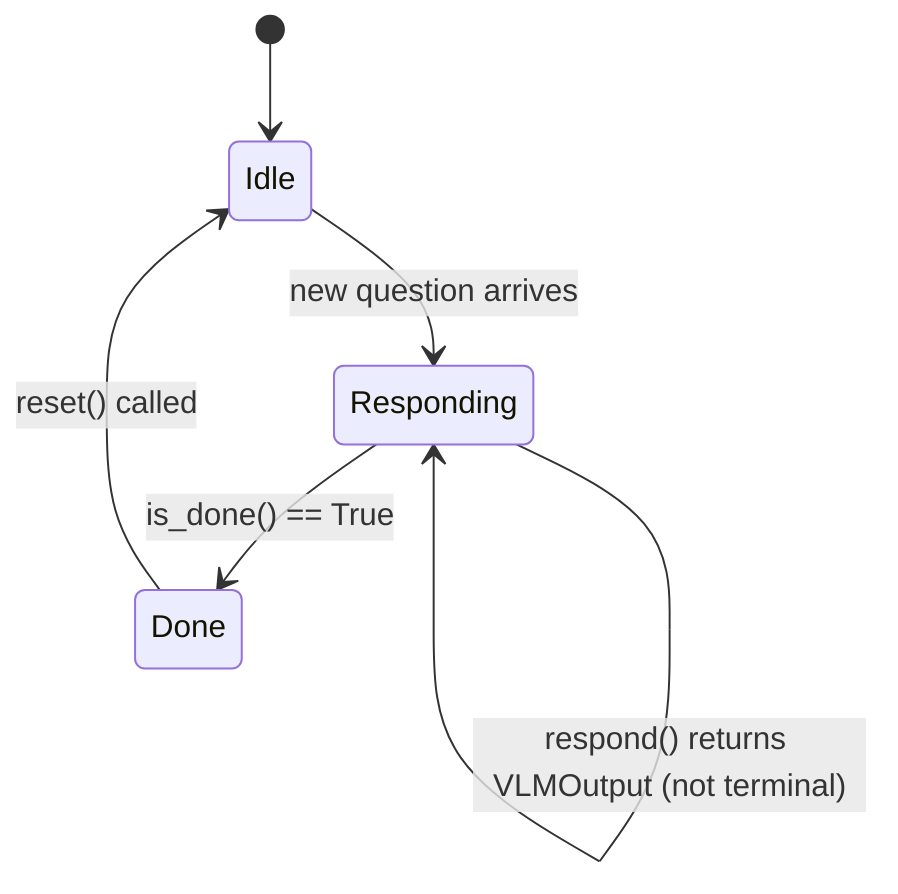

# Responder Protocol

A responder is any object that implements three methods:

```python
class ResponderProtocol:
    def respond(self, snapshot: VLMInput) -> VLMOutput | None: ...
    def is_done(self) -> bool: ...
    def reset(self) -> None: ...
    def close(self) -> None: ...
```

## Method contract

### `respond(snapshot: VLMInput) -> VLMOutput | None`

Called once per tick (2 Hz). Receives the latest sensor snapshot and returns
either a `VLMOutput` to publish or `None` (skip this tick).

### `is_done() -> bool`

Returns `True` when the responder has produced a final answer for the current
question. The tick loop will then:

1. Clear the question from the cache
2. Call `reset()` to prepare for the next question

### `reset()`

Resets internal state (tick counter, evidence log, done flag). Called when:

- A new question arrives (different text from the previous one)
- The responder reports `is_done()`

### `close()`

Cleanup hook called during shutdown. Used by `SceneGeminiResponder` to flush
the VLM tick logger.

## Implementations

### DummyResponder

Deterministic port of the challenge's C++ `dummyVLM.cpp`. Returns fixed
answers without any model inference. No GPU required.

- Numerical: always returns `value=5`
- Object reference: returns a fixed marker position
- Instruction following: returns a single waypoint `(1.0, 0.0)`

### PerceptionResponder

Sidecar-backed perception responder. Detects and segments objects per tick
via YOLO-World + SAM 2.1, projects each mask through the LiDAR scan to lift
it to 3D, and answers from the live scene graph.

### SceneGeminiResponder

The submission responder. Features:

- Driven by the shared app-level `FrontierExplorer` via `ingest()`
- Builds the object scene graph during the sweep (delegates to
  `PerceptionResponder`)
- Defers the answer until exploration completes, then sends the populated
  graph + panorama + occupancy map to the Gemini API
- Optional tick logging for debugging (API key stripped from `session.json`)

## Lifecycle in the tick loop



## Selecting a responder

Set `XIAO_HEI_RESPONDER` environment variable:

```bash
XIAO_HEI_RESPONDER=dummy         # DummyResponder (no GPU)
XIAO_HEI_RESPONDER=perception    # PerceptionResponder (needs the sidecar)
XIAO_HEI_RESPONDER=scene_gemini  # SceneGeminiResponder (sidecar + Gemini API key)
```
