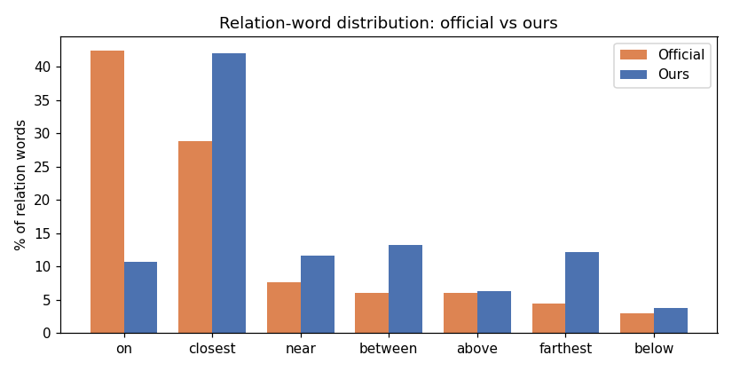
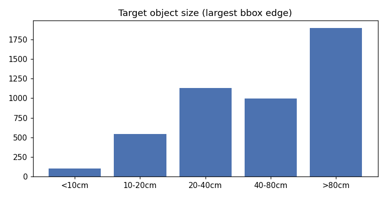
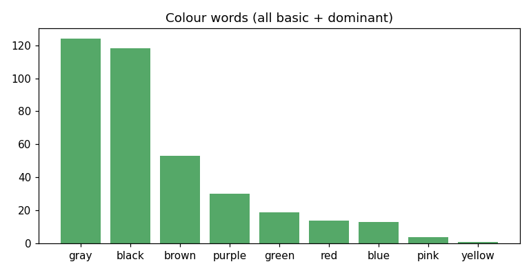
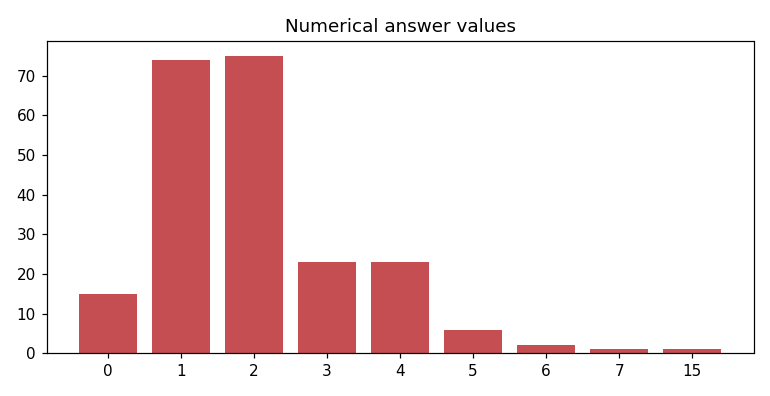
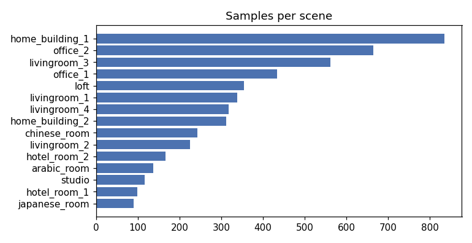

# EDA — VLA-3D Q&A Corpus

Exploratory analysis of the generated training corpus (`dataset/vla3d_ref.jsonl`
+ `vla3d_num.jsonl`), derived from the 15-scene VLA-3D Unity subset and aligned
to the CMU VLN Challenge official question set. Numbers reflect the current
corpus; regenerate with `dataset_generator/regen.sh`.

## 1. At a glance

| | |
|---|---|
| Total Q&A pairs | **4,894** |
| object_reference | 4,674 (95%) |
| numerical | 220 (5%) |
| instruction_following | not generated yet |
| Sources | single-layer ref 3,500 · nested 1,214 · numerical templates 180 |
| Scenes | 15 |
| Determinism | seed 42 (byte-identical regen) |

Each row = one question + the **scene object list** (every object as
`id x y z lx ly lz heading "label"`) + the answer (`object_id`+label for ref, an
integer for num). Type labels agree 100% with the runtime question router
(`check_question_types`: 0 mismatches).

## 2. Spatial relations — the headline distribution

| relation | official | ours |
|----------|---------:|-----:|
| on | 42.4% | 12.6% |
| closest | 28.8% | 42.2% |
| near | 7.6% | 10.9% |
| between | 6.1% | 12.3% |
| above | 6.1% | 6.3% |
| farthest | 4.5% | 11.2% |
| below | 3.0% | 4.5% |

**Finding.** After reweighting, `closest` leads and `near`/`farthest` are
minorities (matching the official *ranking*). The one gap that can't close is
**`on` (12.6% vs 42.4%)**: humans default to "the bowl *on* the table", but the
VLA-3D scene graph holds only **819 `on` pairs vs 39,278 `near`** — `near` is
computed for every nearby pair while `on` needs real physical support. `closest`
absorbs the primary-relation role that `on` can't fill. See the
*relation-word reweight* note in `dataset_generator/README.md`.

## 3. Target objects & answers

Target size (largest bbox edge): median ~56 cm, but **~14% are <20 cm**
(cup, candle, spoon, light switch…). The official set keeps its returnable
*targets* distinctive/tabletop-scale-or-larger, so very small targets are a mild
distribution risk — perception on the 360°/1920×640 camera resolves only a few
pixels for an 8 cm object. (Filtering deferred.)

Colour modifiers are now all **basic words at the object's dominant colour**
(`maroon→red`, `olive→green`, etc.); minority-colour descriptors like the old
"blue book" (76% gray) are gone. Colour appears in ~7% of questions, matching
official.

Numerical answers cluster at **1–2** (73 + 77 of 220) with a thin tail. Counts
of 1 are intentional (official "How many red pillows are on the sofa?" = 1). The
`0` slice (15) is the **refusal** case ("How many pianos are there in the
room?") — deliberately balanced by an equal-phrasing **totals** slice (~30,
answers ≥1) so the "…in the room?" wording doesn't become a "⇒ 0" shortcut (0 is
33% of that phrasing, not 100%).

## 4. Scene coverage

Samples are uneven across scenes — the multi-room `home_building_1` (867) and
the dense `office_2` (662) dominate; small single rooms like `japanese_room`
(102) contribute least. This tracks each scene's object/relation density. For
train/val/test, split **by scene** (group K-fold) so generalisation to unseen
scenes is measured honestly.

## 5. Phrasing features (object_reference)

| feature | official | ours |
|---------|---------:|-----:|
| compositional (≥2 relations) | 57% | 28% |
| colour modifier | 7% | 7% |
| indefinite "a X" anchor | 13% | ~11% |
| omit-"Find" ("The X …") | 10% | 10% |
| ordinal ("second closest") | 0% | 0% |

`compositional` is below target — a trade-off of the relation reweight
(compositional questions are nested, and nested supply *is* `near`/`farthest`,
which we capped). VLA-3D can't be both 57%-compositional and `on`/`closest`-heavy.

## 6. Data problems found & fixed (the interesting part)

Each problem below was found by inspecting individual samples in the 3D
visualizer, quantified across the corpus, then gated or reweighted out:

| # | problem | example | before → after |
|---|---------|---------|---------------:|
| 1 | **Redundant constraint** — target class already unique in view, so the spatial relation does nothing | "Find the dvd beside the big chair" (only 1 dvd) | 37% → **0%** |
| 2 | **Relation-word skew** — supply-driven `near`/`farthest` heavy, unlike the `on`/`closest`-led official set | corpus was 29% `near` + 29% `farthest` | reweighted: `closest` leads, `near`/`farthest` minority |
| 3 | **Tied superlative** — `closest`/`farthest` candidates stacked / equidistant → no determinate answer | "the file nearest the plant" (two files at the same x,y) | 14% → **1.4%** |
| 4 | **Distance through a wall** — straight-line ≠ navigable proximity | "the cabinet closest to the fire alarm" (glass partition between) | 23% → **0%** |
| 5 | **Weak / technical colour** — minority colour, or VLA-3D's palette vs the official basic words | "the blue book" (76% gray); `maroon` mapped to `red` | 37% → **0%** |
| 6 | **"in the room ⇒ 0" shortcut** — refusals (N5, answer 0) shared a phrasing with nothing positive | every "…in the room?" was 0 | balanced with N4 totals → 0 is **33%** of that phrasing, not 100% |

Problems 1, 3, 4, 5 are **logical defects** (the sample is wrong or
unanswerable); 2 and 6 are **training-bias** issues (the sample is valid but the
distribution would teach a wrong cue). All were fixed in the generators, not by
hand-editing the data.

A code review surfaced three more **cross-generator consistency** problems,
since closed: the single-layer and nested generators each applied the gates
independently, so (a) `near` was enforced as a strict *closest* superlative in
the single-layer half but as a 1.5 m-radius relation in the nested half — two
definitions of the same word; (b) object labels used VLA-3D's normalized class
("television") in one half and raw_label ("tv") in the other, putting both words
for the same object in the merged corpus; (c) the wall-between and colour gates
ran on only one generator. All three are now resolved by sharing the gates and
the label vocabulary (`geometry.py`, `phrasing.py`, raw_label everywhere).

The gates also shrank the corpus (a `closest`-led, defect-free corpus is
supply-limited to ~5k vs an earlier 12k that was `near`/`farthest`-heavy and
included these defects).

## 7. Takeaways

- **Well-aligned:** relation *ranking*, colour 7%, omit-Find 10%, zero ordinals,
  and the four logical-defect classes gated to ~0.
- **Supply-capped (documented, not bugs):** `on` (12.6% vs 42%) and
  compositional (28% vs 57%) — VLA-3D's geometry can't supply more without
  re-introducing `near`/`farthest` skew or duplicating the ~84 usable `on`
  anchors.
- **Open:** `instruction_following` not generated (needs official forbidden-zone
  labels); ~14% very small targets left in; numerical supply-capped at ~220.

*Charts: `docs/eda_assets/*.png`, regenerated by
`uv run python dataset_generator/eda_report.py` (run after
`dataset_generator/regen.sh`).*
