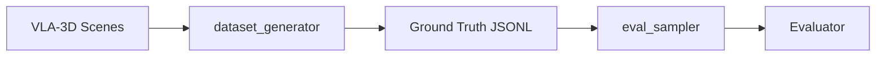

# Data Generation

The project uses VLA-3D generated datasets for offline evaluation and
prompt development.

## Dataset pipeline



## Ground truth format

Each line in the ground-truth JSONL contains:

```json
{
  "question": "How many chairs are in the room?",
  "question_type": "numerical",
  "answer": {"kind": "numerical", "value": 4}
}
```

For object references:

```json
{
  "question": "Find the red cup",
  "question_type": "object_reference",
  "answer": {
    "kind": "object_reference",
    "label": "red_cup",
    "object_id": 7,
    "center": {"x": 2.1, "y": -0.5, "z": 0.8},
    "size": {"x": 0.1, "y": 0.1, "z": 0.15}
  }
}
```

## Generating the corpus

Regenerate the full Q&A corpus end-to-end (single-layer ref → numerical →
nested compositional → type-consistency check):

```bash
bash dataset_generator/regen.sh      # writes dataset/*.jsonl (gitignored)
```

The generators live in `dataset_generator/`. Every row bakes the per-scene
`object_list` (each object as `id x y z lx ly lz heading "label"`) via
`vla3d_loader.render_object_list`; the answer's `object_id` indexes into that
list. The full pipeline — phrasing-distribution alignment to the official set
and the data-quality gates (redundant-constraint, tied-superlative,
wall-between, colour) — is documented in the generator reference
**`dataset_generator/README.md`**.

!!! note
    `object_list` is produced **inside** the generator, not by a standalone
    CLI. `xiao_hei_vln.eval_sampler.object_list` is a parsing *library*
    (`parse_object_list`), not a runnable command.

## Exploring the result

See **[Dataset EDA](../eda_report.md)** for distributions (relation words,
object sizes, colours, per-scene counts) and the data-quality audit
(before/after each gate). Charts regenerate with
`uv run python dataset_generator/eda_report.py`.

## Current status

- Numerical questions: ground truth from VLA-3D object counts
- Object reference: ground truth from VLA-3D bounding boxes
- Instruction following: requires official evaluator (no offline ground truth)
