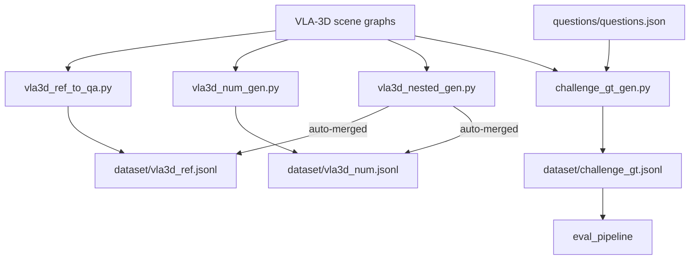

# Data Generation

The project generates three ground-truth datasets from VLA-3D scene data.
All scripts live in `dataset_generator/` and write output to `dataset/`.

## Dataset overview

| File | Questions | Type | Script |
|---|---|---|---|
| `dataset/challenge_gt.jsonl` | 45 | official challenge questions | `challenge_gt_gen.py` |
| `dataset/vla3d_ref.jsonl` | 7 708 | VLA-3D object-reference | `vla3d_ref_to_qa.py` |
| `dataset/vla3d_num.jsonl` | 591 | VLA-3D numerical | `vla3d_num_gen.py` |

Use `challenge_gt.jsonl` when scoring real challenge runs.  Use the VLA-3D
files for training, ablations, and development evaluation.

## Pipeline diagram



## Regenerating VLA-3D datasets

Use the one-shot driver:

```bash
bash dataset_generator/regen.sh
```

This runs all four steps (ref → num → nested → type-check) and prints a
summary.  Individual scripts can also be run directly:

```bash
# Object-reference Q&A
uv run python dataset_generator/vla3d_ref_to_qa.py

## Generating the corpus

Regenerate the full Q&A corpus end-to-end (single-layer ref → numerical →
nested compositional → type-consistency check):

```bash
bash dataset_generator/regen.sh      # writes dataset/*.jsonl (gitignored)
```

The generators live in `dataset_generator/`. Every row bakes the per-scene
`object_list` (each object as `id x y z lx ly lz heading "label"`) via
`vla3d_loader.render_object_list`; the answer's `object_id` indexes into that
list. The full pipeline — phrasing-distribution alignment to the official set
and the data-quality gates (redundant-constraint, tied-superlative,
wall-between, colour) — is documented in the generator reference
**`dataset_generator/README.md`**.

!!! note
    `object_list` is produced **inside** the generator, not by a standalone
    CLI. `xiao_hei_vln.eval_sampler.object_list` is a parsing *library*
    (`parse_object_list`), not a runnable command.

## Exploring the result

See **[Dataset EDA](../eda_report.md)** for distributions (relation words,
object sizes, colours, per-scene counts) and the data-quality audit
(before/after each gate). Charts regenerate with
`uv run python dataset_generator/eda_report.py`.

## Current status

- Numerical questions: ground truth from VLA-3D object counts
- Object reference: ground truth from VLA-3D bounding boxes
- Instruction following: requires official evaluator (no offline ground truth)
