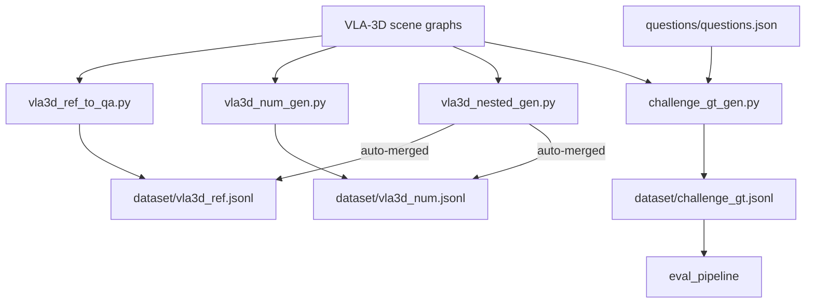

# Data Generation

The project generates three ground-truth datasets from VLA-3D scene data.
All scripts live in `dataset_generator/` and write output to `dataset/`.

## Dataset overview

| File | Questions | Type | Script |
|---|---|---|---|
| `dataset/challenge_gt.jsonl` | 45 | official challenge questions | `challenge_gt_gen.py` |
| `dataset/vla3d_ref.jsonl` | 7 708 | VLA-3D object-reference | `vla3d_ref_to_qa.py` |
| `dataset/vla3d_num.jsonl` | 591 | VLA-3D numerical | `vla3d_num_gen.py` |

Use `challenge_gt.jsonl` when scoring real challenge runs.  Use the VLA-3D
files for training, ablations, and development evaluation.

## Pipeline diagram



## Regenerating VLA-3D datasets

Use the one-shot driver:

```bash
bash dataset_generator/regen.sh
```

This runs all four steps (ref → num → nested → type-check) and prints a
summary.  Individual scripts can also be run directly:

```bash
# Object-reference Q&A
uv run python dataset_generator/vla3d_ref_to_qa.py

# Numerical Q&A
uv run python dataset_generator/vla3d_num_gen.py

# Nested (compound spatial) Q&A — auto-merged into ref/num on load
uv run python dataset_generator/vla3d_nested_gen.py
```

## Generating `challenge_gt.jsonl`

```bash
uv run python dataset_generator/challenge_gt_gen.py
```

Pass `--verify` to preview answers without writing the file:

```bash
uv run python dataset_generator/challenge_gt_gen.py --verify
```

Expected output: `Resolved 45 questions  (errors/warnings: 0)`.

### How it works

For each of the 45 scoreable questions in `questions/questions.json`
(numerical + object_reference across 15 training scenes):

1. Load the VLA-3D scene graph for the scene.
2. Resolve the answer using scene-graph spatial relations
   (`on`, `above`, `below`, `near`, `between`, `closest`, `farthest`).
3. Fall back to geometry (Euclidean distance / surface proximity) when the
   scene graph relation is missing.
4. Read the authoritative `object_list.txt` from the scene zip and embed it
   in the GT entry.

Color queries (`"red pillow"`, `"black pillow"`) use a built-in alias map
because VLA-3D's automated color classification uses names like `"maroon"`
for visually red objects.

## Ground-truth format

Every line in any of the three files is a JSON object:

```jsonc
// object_reference
{
  "scene": "arabic_room",
  "type": "object_reference",
  "question": "Find the pillow closest to the book on the stool.",
  "answer": {"object_id": 73, "label": "pillow"},
  "object_list": [
    "0 -3.77 2.05 0.61 0.67 0.64 1.23 0.008 \"potted plant\"",
    // …
  ]
}

// numerical
{
  "scene": "arabic_room",
  "type": "numerical",
  "question": "How many sofas are below a window?",
  "answer": 3,
  "object_list": [ /* same scene object list */ ]
}
```

`object_list` line format: `id cx cy cz lx ly lz heading "label"`

## Current status

| Type | Status |
|---|---|
| `object_reference` | ✅ Full coverage (challenge + VLA-3D) |
| `numerical` | ✅ Full coverage (challenge + VLA-3D) |
| `instruction_following` | ⛔ No offline ground truth — requires official evaluator |
