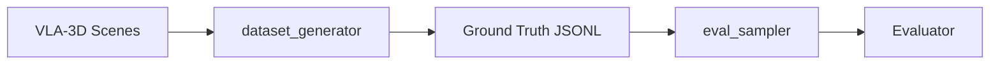

# Data Generation

The project uses VLA-3D generated datasets for offline evaluation and
prompt development.

## Dataset pipeline



## Ground truth format

Each line in the ground-truth JSONL contains:

```json
{
  "question": "How many chairs are in the room?",
  "question_type": "numerical",
  "answer": {"kind": "numerical", "value": 4}
}
```

For object references:

```json
{
  "question": "Find the red cup",
  "question_type": "object_reference",
  "answer": {
    "kind": "object_reference",
    "label": "red_cup",
    "object_id": 7,
    "center": {"x": 2.1, "y": -0.5, "z": 0.8},
    "size": {"x": 0.1, "y": 0.1, "z": 0.15}
  }
}
```

## Generating questions

The `dataset_generator/` directory contains utilities for:

- Extracting object inventories from VLA-3D scenes
- Generating numerical questions ("How many X?")
- Generating object-reference questions ("Find the X")
- Converting scene annotations to ground-truth format

## Object list extraction

```bash
uv run python -m xiao_hei_vln.eval_sampler.object_list \
  --scene dataset_generator/output/scene_001.json \
  --output data/objects.json
```

## Current status

- Numerical questions: ground truth available from VLA-3D object counts
- Object reference: ground truth derived from VLA-3D bounding boxes
- Instruction following: requires official evaluator (no offline ground truth)
