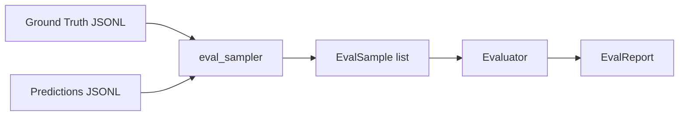

# Evaluation

The offline evaluation pipeline computes metrics for numerical and
object-reference questions without needing the simulator running.

## Overview



## Running evaluation

### From the CLI

```bash
uv run xiao-hei-eval \
  --ground-truth data/ground_truth.jsonl \
  --predictions data/predictions.jsonl \
  --output results/report.json
```

### From Python

```python
from xiao_hei_vln.evaluator import Evaluator, EvalSample, EvalReport

samples = [...]  # list of EvalSample
evaluator = Evaluator()
report: EvalReport = evaluator.evaluate(samples)

print(report.numerical)         # NumericalMetrics or None
print(report.object_reference)  # ObjectReferenceMetrics or None
```

## Metrics

### Numerical questions

| Metric | Description |
|---|---|
| Exact match | Fraction where `prediction == ground_truth` |
| Mean absolute error | Average `|prediction - ground_truth|` |
| Within-1 accuracy | Fraction where `|prediction - ground_truth| <= 1` |

### Object reference questions

| Metric | Description |
|---|---|
| Center distance | Euclidean distance between predicted and GT centers |
| IoU (approximate) | Intersection-over-union of bounding boxes |
| Success rate | Fraction where center distance < threshold |

### Instruction following

Instruction-following evaluation requires the official closed-source
evaluator from the challenge organizers — it measures path efficiency and
goal proximity using the simulator.

## EvalSample format

Each sample pairs a ground truth with a prediction:

```python
@dataclass
class EvalSample:
    question: str
    question_type: QuestionType
    ground_truth: VLMOutput
    prediction: VLMOutput
```

## Generating eval samples

The `eval_sampler` module converts VLA-3D ground-truth annotations and
model predictions into the evaluator format:

```bash
uv run python -m xiao_hei_vln.eval_sampler \
  --gt-jsonl data/vla3d_ground_truth.jsonl \
  --pred-jsonl data/model_predictions.jsonl \
  --output data/eval_samples.jsonl
```

## Generating ground truth from VLA-3D

The `dataset_generator/` directory contains tools for converting VLA-3D
scene annotations into ground-truth JSONL:

```bash
uv run python -m xiao_hei_vln.eval_sampler.gt_converter \
  --input dataset_generator/output/scenes.jsonl \
  --output data/ground_truth.jsonl
```
