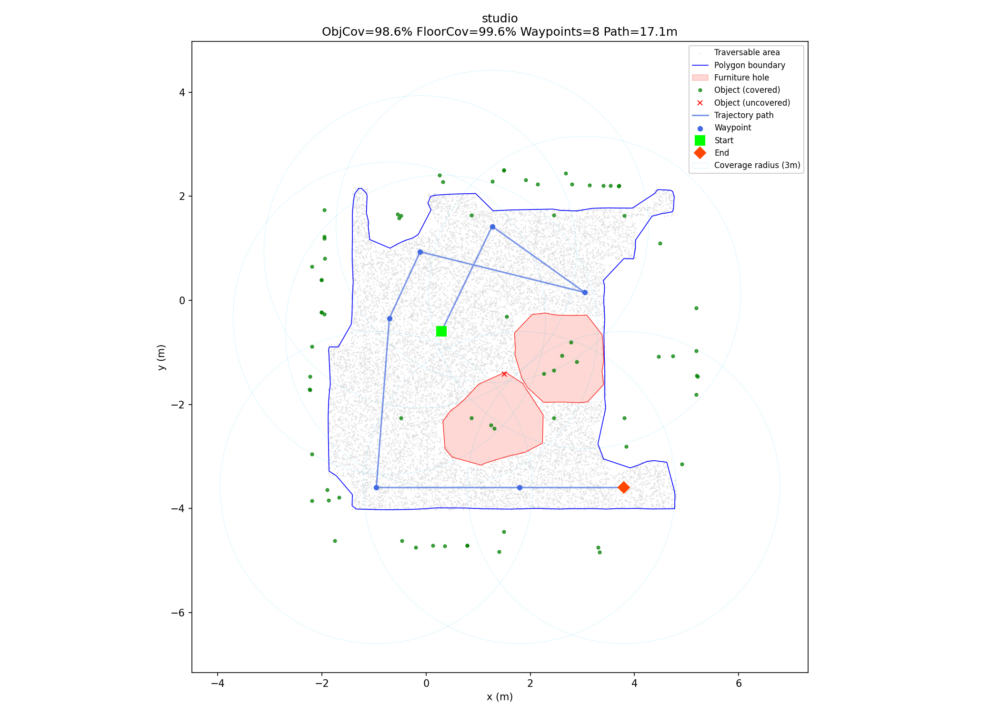
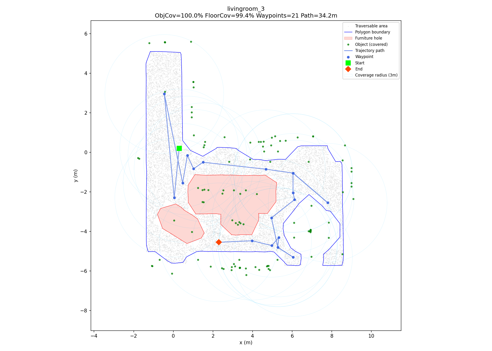
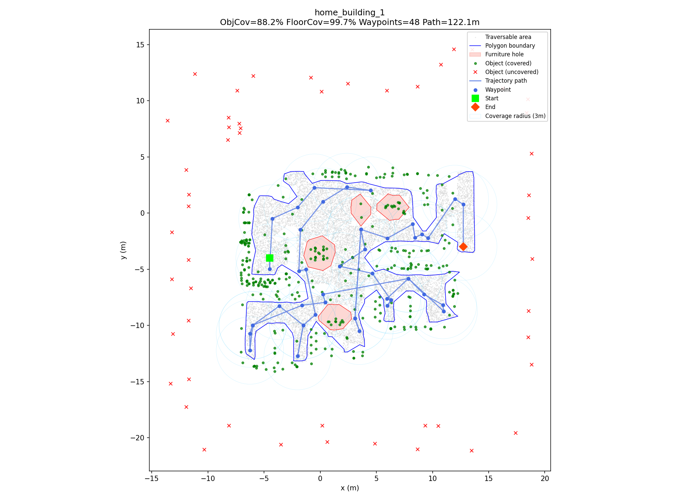

# Coverage Trajectory Generation

The `xiao_hei_vln.trajectory` module generates offline coverage trajectories
for CMU VLN Challenge scenes. Given a scene's traversable area and object list,
it produces an ordered list of waypoints that maximizes object and floor
visibility.

## Pipeline overview


## Quick start

Process a single scene:

```bash
uv run python -m xiao_hei_vln.trajectory path/to/scene.zip
```

Process all scenes in batch:

```bash
uv run python -m xiao_hei_vln.trajectory --batch path/to/zips/ --out trajectories/
```

### CLI options

| Flag | Default | Description |
|------|---------|-------------|
| `--coverage-radius` | `3.0` | Object/floor visibility radius (meters) |
| `--robot-radius` | `0.3` | Polygon erosion for safe waypoint placement |
| `--grid-resolution` | `0.25` | Candidate viewpoint grid spacing (meters) |
| `--hull-ratio` | `0.1` | Concave hull tightness (lower = tighter) |
| `--out` | `trajectories` | Output directory |

## Algorithm

### 1. Polygon construction

The traversable area point cloud is converted to a 2D polygon using
`shapely.concave_hull(ratio=0.1, allow_holes=True)`. Holes in the surface
correspond to furniture and obstacles. The polygon is then eroded inward by
the robot radius (0.3m) to ensure waypoints are safely reachable.

### 2. Candidate sampling

A regular grid at 0.25m spacing is overlaid on the eroded polygon's bounding
box. Only points inside the polygon are kept as candidate viewpoints.

### 3. Coverage computation with 2D raycasting

For each candidate viewpoint, visibility is computed for both objects and floor
cells:

- **Range check**: target must be within 3m (KD-tree range query)
- **Line-of-sight**: `LineString([viewpoint, target])` must not intersect any
  furniture hole polygon (2D raycasting)
- **Host-hole exclusion**: objects sitting on furniture (within 0.5m of a hole
  boundary) skip raycasting against that specific hole, preventing furniture
  from blocking its own contents

### 4. Greedy weighted set cover

Viewpoints are selected greedily to maximize:

$$\text{score} = 10 \times \text{new objects covered} + \text{new floor cells covered}$$

The 10× weight ensures objects drive viewpoint selection. The algorithm
continues until all reachable objects are covered and floor coverage exceeds
95%.

### 5. TSP ordering

Selected viewpoints are ordered using nearest-neighbor TSP with 2-opt
improvement. Distances are **geodesic** (shortest collision-free path through
the visibility graph), not Euclidean.

### 6. Collision-free routing

A visibility graph is built from the selected waypoints and the eroded polygon
boundary vertices. Dijkstra's algorithm routes between consecutive waypoints,
inserting intermediate polygon vertices at corners where direct paths are
blocked.

### 7. Shortcutting

Greedy post-processing removes intermediate routing vertices where a direct
segment is collision-free. Coverage viewpoints are protected and never removed.

## Output format

Each scene produces:

- **JSON file** with waypoints, coverage metrics, and statistics
- **PNG visualization** showing trajectory, objects, and coverage

```json
{
  "scene": "studio",
  "waypoints": [
    {"x": 1.25, "y": -0.50, "heading": 0.78},
    {"x": 2.00, "y": 0.25, "heading": 1.57}
  ],
  "object_coverage": 0.986,
  "floor_coverage": 0.996,
  "path_length_m": 17.1,
  "num_waypoints": 8
}
```

## Objects outside the polygon

Most objects (70–97% per scene) have their 2D center outside the traversable
polygon. This is expected — the polygon represents walkable floor, while objects
sit on, against, or above the boundary:

| Category | Examples | Typical distance |
|----------|----------|-----------------|
| Wall-mounted | pictures, windows, TVs, wall lamps | 0.3–1.5m |
| Furniture against walls | sofas, beds, chairs, tables | 0.3–0.7m |
| Items on furniture | pillows, bottles, books, vases | 0.3–1.2m |
| Ceiling-mounted | ceiling lights, focus lights | 0.0–1.6m |
| Truly outdoor | trees, gates, exterior doors | 5–12m |

Objects in categories 1–4 are still covered because the algorithm checks
visibility from viewpoints **inside** the polygon to objects **outside** it,
as long as they are within 3m with clear line-of-sight.

## Examples

The visualizations below show three representative scenes. The legend is consistent
across all plots:

- **Light grey dots** — traversable area point cloud
- **Blue outline** — walkable polygon boundary
- **Pink fill** — furniture holes (obstacles detected as gaps in the floor)
- **Green dots** — objects successfully covered (within 3 m, clear line-of-sight)
- **Red ×** — objects not covered (outdoor items or behind occluders)
- **Blue line + dots** — planned trajectory and waypoints
- **Green square** — trajectory start · **Orange diamond** — trajectory end
- **Light blue circles** — 3 m coverage radius around each waypoint

### Studio — single room

8 waypoints · 98.6% object coverage · 99.6% floor coverage · 17.1 m path

The studio fits entirely within the 3 m observation radius from a compact set of
viewpoints. Only 1 object (object #68, a lamp near the outer wall) is missed because
it falls beyond the traversable boundary at a distance > 3 m.



### Livingroom 3 — L-shaped room

21 waypoints · 100% object coverage · 99.4% floor coverage · 34.2 m path

The L-shaped floor plan requires the trajectory to turn a corner to reach the second
arm of the room. The greedy set cover selects 9 coverage viewpoints; the remaining 12
waypoints are intermediate routing vertices inserted by the visibility graph to navigate
around furniture holes.



### Home Building 1 — multi-room building

48 waypoints · 88.2% object coverage · 99.7% floor coverage · 122.1 m path

The largest scene in the dataset (432 objects, ~122 m path). The 51 uncovered objects
(red ×) are outdoor items — trees, gates, and exterior lamps — that are 5–12 m from the
walkable area and physically unreachable from inside the building. All indoor objects
are covered.



## Coverage results

| Scene | Objects | ObjCov% | FloorCov% | Waypoints | Path (m) |
|-------|---------|---------|-----------|-----------|----------|
| arabic_room | 85 | 97.7% | 97.8% | 12 | 18.3 |
| chinese_room | 96 | 100.0% | 98.8% | 8 | 14.8 |
| home_building_1 | 432 | 88.2% | 99.7% | 48 | 122.1 |
| home_building_2 | 227 | 97.8% | 99.7% | 47 | 103.5 |
| hotel_room_1 | 86 | 97.7% | 99.8% | 16 | 26.4 |
| hotel_room_2 | 95 | 100.0% | 99.6% | 11 | 14.6 |
| japanese_room | 63 | 100.0% | 99.2% | 6 | 9.0 |
| livingroom_1 | 106 | 98.1% | 99.4% | 7 | 11.4 |
| livingroom_2 | 88 | 100.0% | 99.7% | 13 | 25.4 |
| livingroom_3 | 108 | 100.0% | 99.4% | 21 | 34.2 |
| livingroom_4 | 120 | 100.0% | 97.7% | 7 | 10.2 |
| loft | 115 | 94.8% | 98.9% | 9 | 11.5 |
| office_1 | 112 | 100.0% | 97.9% | 12 | 17.2 |
| office_2 | 161 | 100.0% | 100.0% | 12 | 22.0 |
| office_building_1 | 0 | — | 95.5% | 41 | 184.0 |
| office_building_2 | 0 | — | 95.1% | 74 | 330.8 |
| studio | 73 | 98.6% | 99.6% | 8 | 17.1 |

11 of 15 object scenes achieve ≥97.7% object coverage (7 at 100%).
All 18 scenes achieve ≥95% floor coverage. Uncovered objects are primarily
outdoor items beyond 3 m from the walkable area.

## Python API

```python
from pathlib import Path
from xiao_hei_vln.trajectory import plan_trajectory_from_zip

result = plan_trajectory_from_zip(
    Path("scene.zip"),
    scene_name="studio",
    coverage_radius=3.0,
    robot_radius=0.3,
    grid_resolution=0.25,
)

print(f"Object coverage: {result.coverage.object_coverage:.1%}")
print(f"Floor coverage: {result.coverage.floor_coverage:.1%}")
print(f"Waypoints: {len(result.waypoints)}")
print(f"Path length: {result.path_length_m:.1f}m")
```
