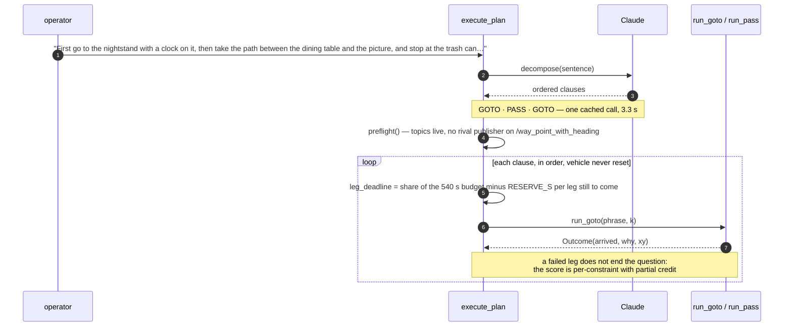
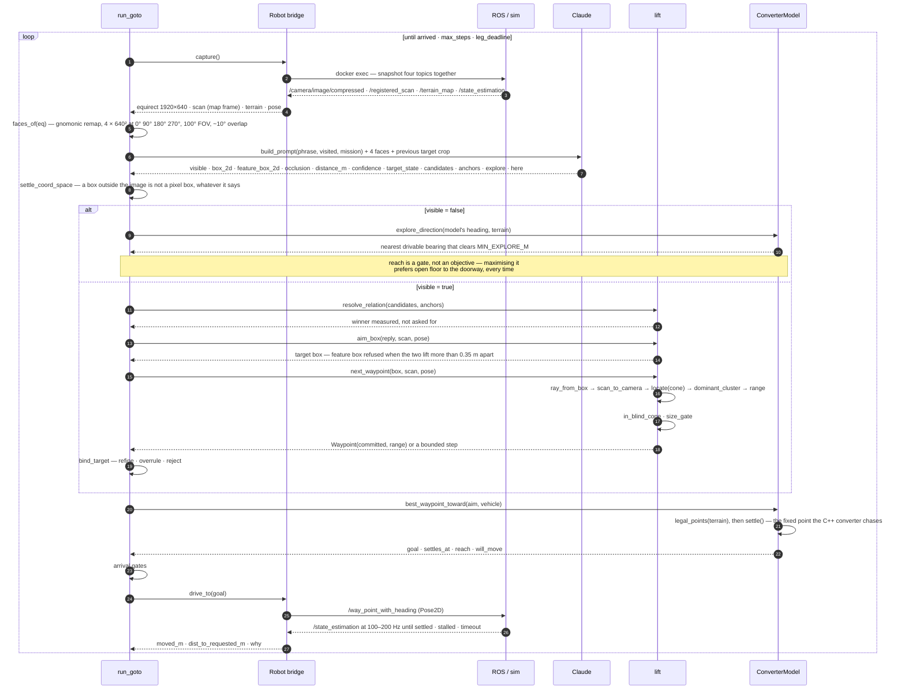
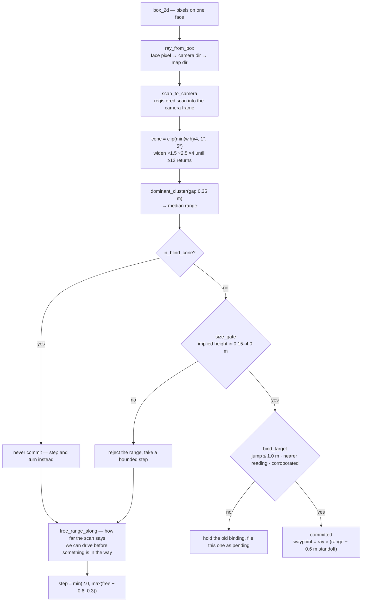

# Ground, Lift, Drive

One grounding step, end to end.

The division the whole pipeline is built on: **the model proposes semantics,
geometry decides metres, the stack decides motion** — and no stage is allowed to
do another's job. Every measured failure in the task reports is a case of one
actor having been trusted with another's decision.

| Actor | Decides | Never decides |
|---|---|---|
| **Claude** — semantics | Which pixels are the thing. Names, boxes, occlusion, candidates and anchors. | The winner of a comparison, or a distance anything acts on. |
| **Lidar** — metres | Where that is, in the map frame: a ray through the box centre, the returns inside a cone, one depth cluster. | What the thing is. |
| **Stack** — motion | How the vehicle gets there. We model `waypointXYRadius` and the terrain ourselves so the goal we publish is one the converter will not move somewhere we did not mean. | Whether we have arrived. |

---

## One question becomes an ordered plan

The sentence is decomposed once, by the model, at step 0. The executor holds the
progress cursor and only ever moves it forward — the model is shown which step is
current but is never asked which step to do next.

`scripts/execute_plan.py` · `scripts/decompose.py` · budget 540 s, RESERVE_S 70 s
per remaining leg.

---

## One grounding step

This is the loop that costs money and time — roughly **35 seconds and one Claude
call per iteration**, against a ten-minute budget for the whole question.

`approach_loop.run_goto` · one Claude call per iteration · ~35 s wall clock per
step, measured over the 0814 runs.

---

## Inside the lift — a box becomes metres

The single most error-prone hop in the system. A box edge that slips past the
object's silhouette puts the ray on the wall behind it, and the error along the
ray is unbounded.

`next_waypoint` never guesses a range. It either commits to a measured one or
takes a step whose length is itself measured.

### Why the fallback step is not a guess

`free_range_along` does not estimate where the target is. It answers a different
question the scan can already answer: *how far along this bearing can the vehicle
drive before something is in the way.* It takes the returns between 0.05 m and
1.2 m above the vehicle — the same population `local_planner` refuses to drive
into — and finds the nearest one within 0.35 m of the ray.

The blind cone heals itself by stepping. `COVERAGE_FLOOR_DEG` is body-fixed, so
it rotates with the robot: a bearing at −120° has a floor of −2°, but driving one
leg toward the target swings it near 0° azimuth where the floor is −32.4°, and
the next lift is sound.

`scripts/vlm_approach.py` · `scripts/vlm_locate.py` · `approach_loop.bind_target`

---

## Where the pipeline is allowed to say no

Each of these exists because a run reported success and was wrong.

| Gate | Refuses | Found by |
|---|---|---|
| `in_blind_cone` | A bearing below the scanner's elevation floor. It does not merely lose the lift — it returns a confident wrong one. | 4.70 m against a true ~2.9 m |
| `size_gate` | A range whose implied object height falls outside 0.15–4.0 m. | passed a 0.15 m reading by 1 cm on `o_2_0814_02` |
| `aim_box` | A `feature_box_2d` that lifts more than 0.35 m from the target box — it is the anchor, not a feature. | drove at the window it was told the cooler was *near* |
| `bind_target` | A reading that jumps more than 1.0 m without a nearer measurement or a second reading agreeing with it. | one wrong binding steering the rest of a leg |
| `says_far` | An arrival declared while the model still reads the target as `far`, on any of the four arrival paths. | 3/3 reported, all short; one by 6.5 m through glass |
| `crosses_gate` | A goal whose *settled* position, or the run to it, crosses a forbidden corridor. Tested on the trajectory, not the waypoint. | a keep-out that caused the violation |

---

## What is measured in what

Four frames, and every bug worth the name lives in a conversion between two of
them. `/registered_scan` arriving already in the map frame is the one piece of
luck here — a stale scan is wrong about *when*, not about *where*.

| Frame | What it is | Units |
|---|---|---|
| **equirect** | The raw panorama, cropped vertically by the sim. | 1920 × 640 px · 360° × 120° |
| **face** | Gnomonic reprojection. Angular size must be measured between edge directions, not by pixels × FOV. | 4 × 640² · 100° FOV |
| **camera** | Where the ray and the returns are compared. One `sensor_to_camera_transform` from the scan. | metres, right-handed |
| **map** | Where bindings, keep-outs, waypoints and the score all live. Heading inverts yaw — `explore_goal` is the only place that knows. | metres · yaw CCW |

### Platform constants the converter model reproduces

| Name | Value | Why it is modelled rather than assumed |
|---|---|---|
| `waypointXYRadius` | 0.30 m | A goal the vehicle settles inside of produces zero motion, which the post-drive test reads as the stack clamping an approach. |
| `vehicleWidth` | 0.50 m | With `obstacleDisThre` 0.75 m, sets which terrain cells can hold a legal waypoint at all. |
| `STANDOFF_M` | 0.60 m | Aim at the target, not at a standoff from it — the inflation is what the standoff is *for*. |
| `NEAR_M` | 1.50 m | Below this, "the converter has nothing closer" means arrival. Above it, it means a terrain map that has not seen the ground near the object. |
| `PROGRESS_M` | 0.25 m | Moving less than this toward a destination is the stack declining, not the vehicle arriving. |

---

## What the diagrams do not show

Three things are drawn as single arrows that are not simple in practice.

**The lift can be blind and not know it.** Glass returns the beam. On
`o_2_0814_02` every ray toward the door produced one tight cluster at 1.65 m and
nothing beyond, so no cluster-selection rule reaches the door — the only signals
that the target is further out are `occlusion` and `target_state`, and until the
`says_far` gate nothing read either of them.

**`dominant_cluster` takes the biggest cluster, not the nearest.** At range the
biggest is often the wall behind the object. Replacing it with the nearest
credible cluster was measured at 4–6 m: 0.40 m → **0.16 m**; beyond 6 m: 3.33 m →
1.69 m. That change has not been made.

**The four faces are re-encoded every call.** They are 2189 of the prompt's
~6000 input tokens and they dominate prefill, which is why prompt caching
measured as a cost win and not a latency one — 2.81 s uncached against 2.96 s
cached.

**An exploration step costs the same as an approach step.** On `hb_1_0814_01`
seven grounding calls — about 280 s, 70% of that leg's budget — were spent inside
a 2.1 × 0.8 m box in a doorway where the drivable reach was under a metre.

---

Drawn from `scripts/execute_plan.py`, `approach_loop.py`, `vlm_approach.py`,
`vlm_locate.py`, `waypoint_converter_model.py`, `robot_io.py`.
